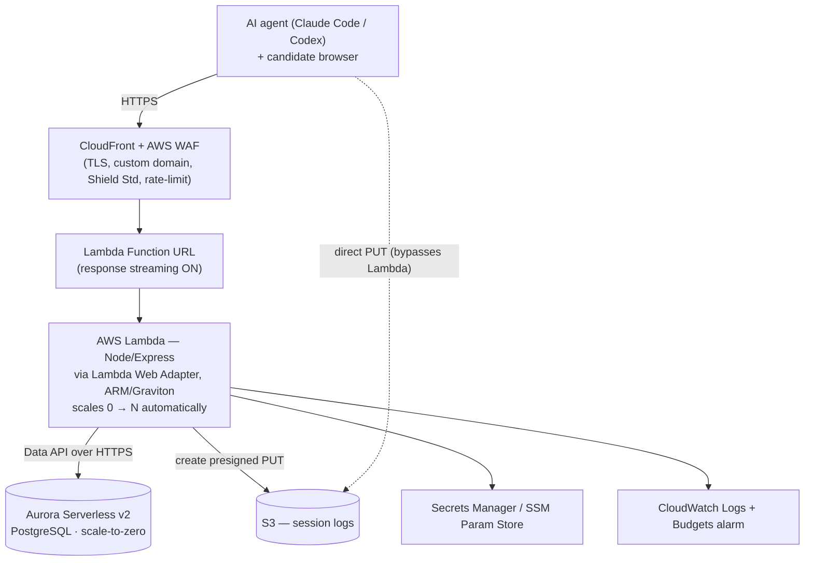

# hiring-mcp — Deployment Architecture (AWS, minimal & scale-to-zero)

> **Status: deferred blueprint.** For current traffic, deploy the `Dockerfile` to a
> single small always-on host (Fly/Fargate/EC2) with managed Postgres + S3 — fewer
> moving parts, same code. Revisit this serverless design when traffic is real.
> Note: the in-process rate limiter and `pg.Pool` both assume a single instance;
> the driver swap below addresses the pool, the limiter needs a shared store.

Goal: deploy the `hiring-mcp` service (Express + MCP, Postgres/Drizzle, S3 presigned uploads)
with **as few services as possible**, **automatic 0 → millions autoscaling**, and **no idle cost**.

This is roadmap item **P2.2**.

> Why this fits our app: the MCP transport is **stateless** (`sessionIdGenerator: undefined`),
> so any compute instance can serve any request, and large uploads go **direct to S3 via
> presigned URLs** — they never pass through compute. Both are what make scale-to-zero viable.

---

## Architecture

---

## Services & rationale (5 core, all pay-per-use)

| Service | Why this one | Idle cost |
|---|---|---|
| **Lambda** (Function URL, Web Adapter, ARM) | True 0→millions autoscaling, pay per request+ms. Express runs unmodified via [Lambda Web Adapter](https://github.com/awslabs/aws-lambda-web-adapter). **Function URL, not API Gateway** — API GW adds $1.00/1M requests; Function URL has no per-request fee. Streaming supports MCP's SSE responses. | **$0** |
| **Aurora Serverless v2 PostgreSQL** + **Data API** | Postgres-compatible (Drizzle schema unchanged), autoscales ACUs, and **scales to zero** when idle. **Use the Data API** (`drizzle-orm/aws-data-api/pg`) — HTTP calls, *no persistent connections*, so Lambda never exhausts the pool and needs no VPC / RDS Proxy. | **~$0** paused |
| **S3** | Already used. Infinite scale, pay-per-use. Presigned PUTs upload **directly** from the client — files never touch Lambda (avoids the 6 MB payload limit). | ~$0 |
| **CloudFront + WAF** | TLS, custom domain, DDoS (Shield Standard, free), WAF rate-limiting to cap abuse/cost. | ~$0 |
| **Secrets Manager** (or SSM Parameter Store) | DB creds, `SESSION_SECRET`, `ADMIN_TOKEN`. Aurora Data API authenticates via Secrets Manager natively. SSM SecureString is the cheaper/free alternative. | ~$0–$1.20 |

CloudWatch logs/metrics + an **AWS Budgets alarm** round it out.

---

## Estimated monthly cost (us-east-1, approx.)

### Low — 1,000 req/day (~30k/mo)

| Item | Cost |
|---|---|
| Lambda | ~$0 (free tier) |
| Aurora SLv2 (scale-to-zero, active a few hrs/day) | ~$5–15 |
| S3 + CloudFront + CloudWatch | <$2 |
| Secrets Manager (3 secrets) | ~$1.20 (or $0 via SSM) |
| **Total** | **≈ $8–18/mo** (dominated by DB active time) |

### High — 1M req/min

Two regimes — be honest about both:

- **As a burst** (realistic): 1M req/min for **one hour** = 60M requests ≈ **~$110 for that hour**
  (Lambda ~$12 requests + ~$100 compute @200ms/512MB), then **$0 again when it subsides**.
  No pre-provisioning, no scaling config. This is the whole value.
- **Sustained for a full month** (43.2 *billion* requests): Lambda alone ≈ **$80k+/mo**, plus
  Aurora and CloudFront request costs into six figures. **At sustained mega-scale, per-request
  economics invert** — see pitfall #6.

---

## Pitfalls & how to avoid them

1. **Lambda + relational DB connection storms** (the classic serverless killer) → **use Aurora
   Data API** (no persistent connections) instead of `pg.Pool` + RDS Proxy. One-line Drizzle
   driver swap; no VPC needed.
2. **Aurora scale-to-zero resume latency (~10–15s cold)** → first request after idle is slow.
   Accept it for low traffic, or keep a tiny scheduled ping if you need a warm DB. Don't set a
   provisioned minimum (that reintroduces idle cost).
3. **Lambda cold starts** → small bundle, **ARM/Graviton**, avoid VPC (Data API lets you). Skip
   provisioned concurrency — it's a fixed cost that violates "no idle".
4. **MCP streaming + API Gateway 30s buffering limit** → don't front with API Gateway; use
   **Function URL with response streaming** for SSE and long responses.
5. **Migrations at cold start** → never run Drizzle migrations on Lambda init. Run them as a
   **one-off CI/CodeBuild step** (or a separate invoke) before deploy.
6. **Cost runaway / DDoS at extreme load** → **WAF rate-limit** on CloudFront, an **AWS Budgets
   alarm**, and a **Lambda reserved-concurrency cap** to bound blast radius. If you ever sustain
   >~50–100M req/day, re-evaluate **ECS Fargate** (cheaper per request at constant high volume) —
   but it has idle cost, so only switch when load is steady, not spiky.
7. **Secrets in env vars** → keep them in Secrets Manager/SSM, not Lambda env config.
8. **S3 exposure** → bucket stays private; rely on short-lived presigned URLs (already the case).

---

## Code change this implies

Swap the Drizzle driver in `src/db/index.ts` from **`node-postgres`** to the **Aurora Data API
driver** (`drizzle-orm/aws-data-api/pg`) for the Lambda build. Everything else — schema, tools,
web UI, validation — is unchanged. Local dev can keep `node-postgres` against Docker Postgres;
select the driver by environment.

## Suggested next steps (not yet done)
- [ ] Data API driver swap (env-selected: pg locally, Data API in Lambda)
- [ ] Minimal IaC (AWS SAM or CDK) for one-command deploy of the whole stack
- [ ] CI step to run migrations before each deploy
- [ ] WAF rate-limit rule + Budgets alarm
